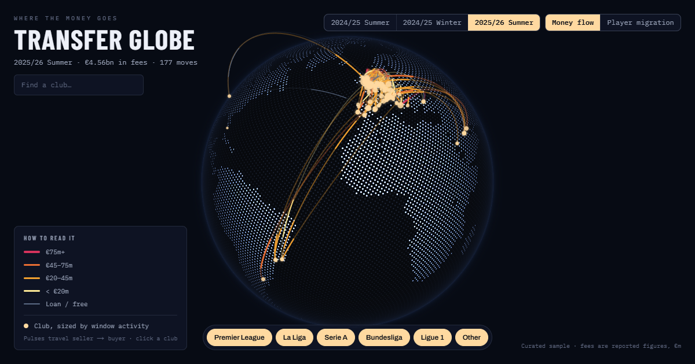

# Transfer Globe

**[transfer-globe.vercel.app](https://transfer-globe.vercel.app)**

An interactive 3D globe of football transfers. Clubs sit on the globe at their
stadium coordinates; every transfer draws an animated arc from the selling club
to the buying club, its width and color encoding the fee. Spin the globe, zoom
in, switch transfer windows, filter by league, and click any club to open its
window — transfers in and out, net spend, and its biggest signing.



## Features

- **Money Flow mode** — one arc per transfer, colored by fee tier
  (< €20m → €75m+, with loans and frees in muted slate) and sized by fee.
  A pulse travels each arc from seller to buyer.
- **Player Migration mode** — arcs bundle by route and thicken with the number
  of players moved, regardless of fee.
- **Club detail panel** — click a marker for spend vs. income, net balance,
  biggest signing, and full in/out lists for the selected window.
- **Three windows** — 2024/25 Summer, 2024/25 Winter, and 2025/26 Summer,
  with headline totals for the selected window.
- **League filters** — the big five European leagues plus "Other"
  (Saudi Pro League, MLS, Brazil, Portugal, and more).
- **Find any club** — search to fly the camera straight to a club and open it.
- **Hover an arc** to name the move, the route, and the fee.
- **Zoom anywhere** — scroll, trackpad pinch, two-finger pinch on touch, or the
  on-screen +/− buttons.
- **Shareable deep links** — the URL tracks the window, mode, and selected club
  (e.g. [`?club=liverpool&window=2024-25-summer`](https://transfer-globe.vercel.app/?club=liverpool&window=2024-25-summer)),
  and restores that state on load.

## How it's built

- [Next.js 15](https://nextjs.org) (App Router) + Tailwind CSS v4, deployed as
  fully static output.
- [COBE](https://github.com/shuding/cobe) renders the WebGL globe. Arcs,
  markers, tooltips, hit-testing, and the fly-to camera are drawn on a 2D canvas
  overlay that reuses COBE's own projection math, so the overlay stays
  pixel-aligned with the sphere at any rotation, zoom, or screen size.
- The render loop is time-based, so rotation and easing run at the same speed on
  60 Hz and 120 Hz displays, and it honors `prefers-reduced-motion`.
- [Recharts](https://recharts.org) for the club panel's spend/income chart.
- A curated static dataset (`public/data/`): 97 clubs and 334 real transfers
  across three windows. Fees are reported figures in €m — treat them as
  illustrative, not gospel.

## Project layout

```
app/
  components/   Globe, FilterBar, ClubPanel, Legend, app shell
  layout.tsx    fonts, metadata, Open Graph card
  page.tsx      loads the dataset, renders the app
lib/
  transforms.ts filtering, marker/arc aggregation, window slugs
  encoding.ts   fee tiers, arc widths, marker sizes, fee formatting
  palette.ts    validated color ramp (COBE + overlay)
  *.test.ts     unit tests for the pure data layer
public/data/    clubs.json, transfers.json
```

## Run it

```bash
npm install
npm run dev     # http://localhost:3000
```

```bash
npm test        # vitest unit tests for the data transforms and encodings
npm run build   # production build
```

## Deploy

Static output with no server dependencies — deploys as-is to
[Vercel](https://vercel.com)'s free tier. Every push to `main` redeploys
production automatically.
